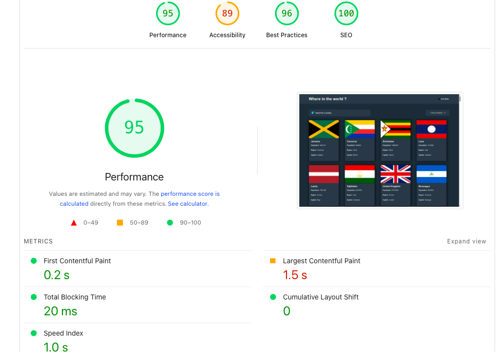
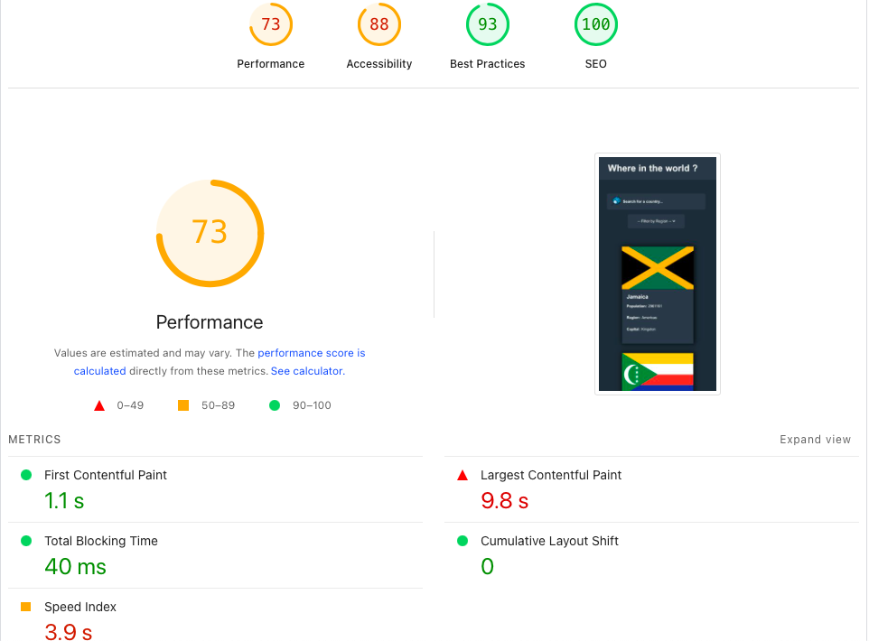

## Welcome! 👋
### This is a solution for REST Countries API with color theme switcher. [Frontend Mentor](https://www.frontendmentor.io) - Please be happy to check challengs, that help you improve your coding skills by building realistic projects. 

### Table of contents

- [Preview](#overview)
    - [The Challenge](#The-challenge)
    - [Link](#Links)
    - [Used Technology](#Used-Technology)
    - [Performance](##Performance)
        - [Dektop](###Desktop)
        - [Mobile](###Mobile)
- [Author](#Author)

### Preview

### The Challenge

Challenge is to build out this Countries app and get it looking as close to the design as possible.

Your users should be able to:

- See all countries from the API on the homepage
- Search for a country using an `input` field
- Filter countries by region
- Click on a country to see more detailed information on a separate page
- Click through to the border countries on the detail page
- Toggle the color scheme between light and dark mode

### Links

[live](https://countryrestmikezeg.netlify.app/)

### Used Technology

 

### Used Tools
  

### Performance

  #### Desktop

  #### Mobile

### Author 🚀
 -- FrontEnd Mentor -> [MikeZeg](https://www.frontendmentor.io/profile/MikeZeg)