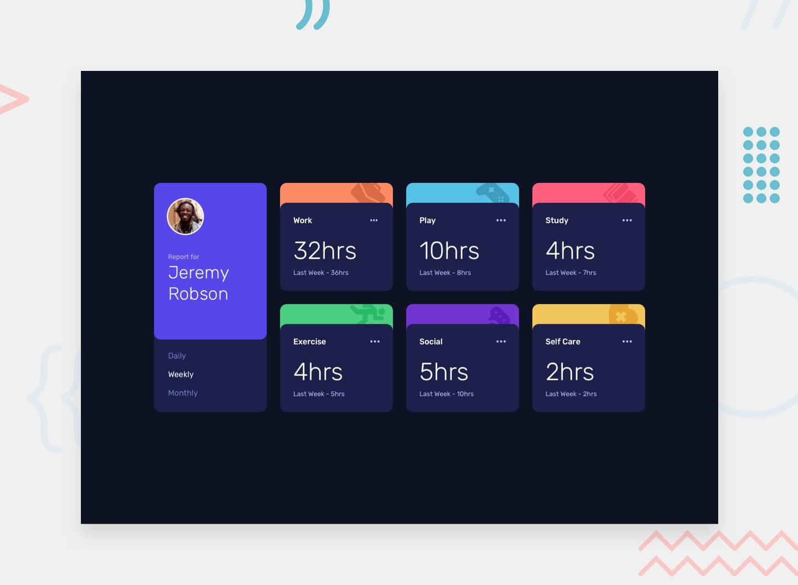

# My solution 👋 - Time Tracking Dashboard. 

Please check my solution on that challeng. If you see somethink to improve, please say somethink.

Please be happy to left the comment on https://www.frontendmentor.io/solutions/. 

[Frontend Mentor](https://www.frontendmentor.io) challenges help you improve your coding skills by building realistic projects.

## Table of contents
- [Overview](#overview)
    -[The Challenge](#The-challenge)
    -[Link](#Links)
    -[Used Technology](#Used-Technology)
-[Author](#Author)

### The Challenge

    Challenge is to build out this dashboard and get it looking as close to the design as possible. To complete the challenge users should be able to: 
        
        - View the optimal layout for the site depending on their device's screen size
        - See hover states for all interactive elements on the page
        - Switch between viewing Daily, Weekly, and Monthly stats
    
    I added extra features to that challenge to be more functional. 
When user press dotts, that boxes can be grabbed and swap with another boxes. When user desactive that feature and refresh page, boxes stay on same location - boxes location will be save in local Storage. 

### Links
    
    - [Live](https://mikezeg.github.io/FrontEndMentor.io/time-tracking-dashboard-main)

### Used Technology

    - HTML5 Semantic
    - CSS 
    - Grid
    - Flexbox
    - Sass
    - JS

## Author
 -- FrontEnd Mentor -> [MikeZeg](https://www.frontendmentor.io/profile/MikeZeg)